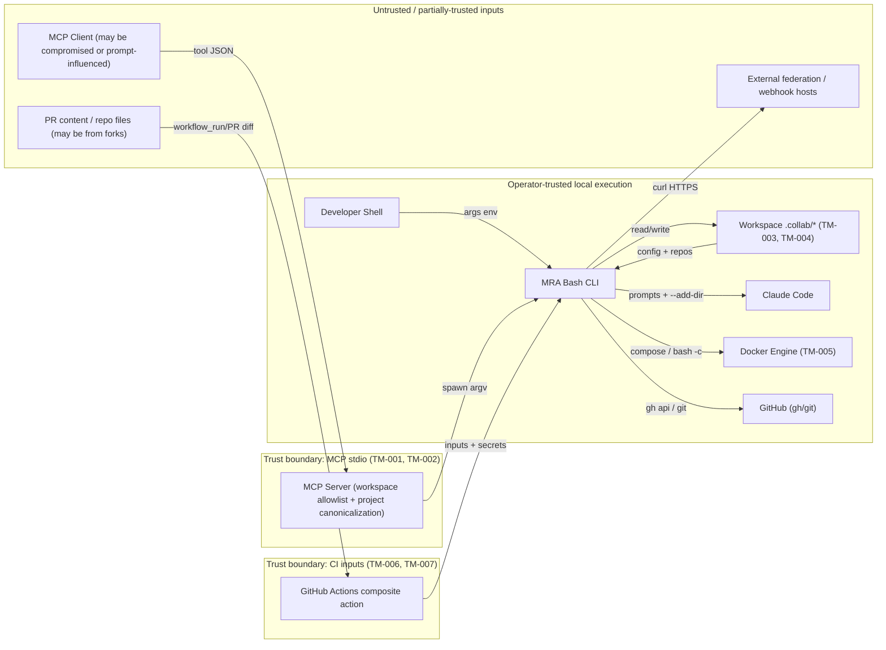

# multi-repo-agent Threat Model and Security Review

## Executive summary

multi-repo-agent is primarily a local developer automation tool: a Bash CLI orchestrates Git repositories, Docker test environments, Claude Code review/planning agents, GitHub API calls, and workspace metadata under `.collab/`. The highest-risk areas are the MCP server boundary, where a tool caller can trigger local CLI actions with the user's filesystem and environment privileges; project/workspace path handling, where several commands join unvalidated project names into filesystem paths; and CI review automation, where composite-action inputs and PR-controlled repository content flow into shell, Claude prompts, and GitHub comments. For normal single-user local usage these are mostly operator-trust risks; for shared MCP servers, untrusted MCP clients, or CI running on untrusted PRs, several become high-priority AppSec issues.

## Status (as of 2026-05-20)

All ten threats listed in this document have been addressed on `main`. The
report is kept as the canonical reference for what the controls look like
and why; treat the threat-model table below as the *as-built* design, not
a backlog. Future regressions to these areas should re-open the relevant
TM in a follow-up section rather than editing the originals in place.

| Threat ID | Status | Commit | Primary test file |
| --- | --- | --- | --- |
| TM-001 path canonicalization | Shipped | `9acfcd2` | `tests/test_project_path.sh` (21 assertions) |
| TM-002 MCP secure-by-default | Shipped | `9acfcd2` | `mcp-server/test/workspace-policy.test.ts` (11 cases) |
| TM-003 .collab identifier regex + jq injection | Shipped | `04793eb` | `tests/test_validate.sh` (17 assertions) |
| TM-004 DB dump SSRF + init gate | Shipped | `a0595c6` | `tests/test_db_safety.sh` (8 assertions) |
| TM-005 Docker first-time trust gate | Shipped | `920b5ad` | `tests/test_docker_trust.sh` (7 assertions) |
| TM-006 CI composite action hardening | Shipped | `9acfcd2` | `bash -n` over all 5 composite-action steps; `actions/mra-code-review/action.yml` lint |
| TM-007 review JSON schema + APPROVE cap | Shipped | `7ffbd45` | `tests/test_review_safety.sh` (12 assertions) |
| TM-008 federation/notify URL allowlist | Shipped | `db912af` | `tests/test_url_policy.sh` (24 assertions) |
| TM-009 snapshot integrity + rollback confirm | Shipped | `141c8c8` | `tests/test_snapshot.sh` (14 assertions) |
| TM-010 install/alias path quoting + RC backup | Shipped | `71db7af` | `tests/test_install_alias.sh` (9 assertions) |

The threat model table further down records the *original* state and the
specific controls each commit added. The Remediation matrix lists patch
sites and acceptance checks for verifying the controls remain in place.

## Scope and assumptions

In scope:

- Runtime CLI: `bin/mra.sh`, `lib/*.sh`, `scanners/*.sh`.
- MCP integration: `mcp-server/src/*.ts`, `mcp-server/test/*.ts`, `mcp-server/claude-mcp-config.json`.
- GitHub Actions integration: `actions/*.yml`, `templates/*.yml`.
- Workspace state and schemas: `.collab/*` producers/consumers, `schemas/*.schema.json`.
- Documentation only as evidence for intended usage and controls: `README.md`, `site/architecture.md`.

Out of scope:

- Test fixtures under `tests/fixtures/sample-workspace/**`, except as examples of expected config shapes.
- Static documentation site implementation, except where it documents operational security assumptions.
- Third-party tools themselves (`claude`, `gh`, `docker`, `git`, `jq`, GitHub Actions runner).

Assumptions:

- Primary deployment is a developer workstation or CI runner, not a public internet-facing service.
- MCP server is stdio-based and normally reachable only by the configured MCP client, but the client or prompts may be partially untrusted.
- `.collab/*.json` and workspace repositories may be shared among team members and may sometimes contain reviewed-but-not-fully-trusted content from GitHub.
- CI review workflow may run on pull requests; if it runs on untrusted forks with secrets available, CI risk increases materially.
- The review did not execute untrusted sample projects or network-dependent commands.

Open questions that could change ranking:

- Is `mra-mcp` ever exposed to a multi-user host, remote agent, or automation system where callers are not fully trusted?
- Do generated MRA review workflows run on fork PRs, and are `ANTHROPIC_API_KEY` or write-capable GitHub tokens available in that context?
- Are `.collab/db.json`, `.collab/dep-graph.json`, and `.collab/notify.json` treated as trusted operator config or committed/shared project artifacts?

## System model

### Primary components

- Bash CLI entrypoint: `bin/mra.sh` dispatches commands such as `init`, `scan`, `db`, `ask`, `test`, `review`, `federation`, `notify`, `rollback`, and project launch. It sources all `lib/*.sh` modules at startup.
- Workspace manager: `lib/init.sh`, `lib/repos.sh`, `lib/sync.sh`, `lib/scan.sh`, and `scanners/*.sh` create `.collab/dep-graph.json`, clone/pull repositories, and infer cross-repo edges.
- Claude orchestration and review: `lib/launch.sh`, `lib/ask.sh`, `lib/review.sh`, `lib/review-debate.sh`, `lib/review-personas.sh`, `lib/plan-council.sh`, and `lib/pkb.sh` assemble prompts, add project directories to Claude Code, and optionally post review output to GitHub.
- Docker and database automation: `lib/docker-exec.sh`, `lib/integration-test.sh`, and `lib/db.sh` start compose services, run project test commands, start DB containers, download/decompress/import dumps, and expose DB ports.
- MCP server: `mcp-server/src/index.ts` exposes 9 tools over stdio, validates `workspace` through `workspace-policy.ts`, then executes `bin/mra.sh` via `mra-executor.ts`.
- CI integration: `templates/code-review-workflow.yml`, `actions/mra-code-review/action.yml`, `actions/mra-setup/action.yml`, and `actions/mra-test/action.yml` install/run MRA in GitHub Actions and post review comments.
- Notifications and federation: `lib/notify.sh` posts to configured webhooks; `lib/federation.sh` publishes, subscribes, fetches, and verifies contract JSON files.

### Data flows and trust boundaries

- Developer shell -> `bin/mra.sh`: command arguments, environment variables, current directory, and local credentials cross via local process invocation. Auth is OS user context; validation is mostly command-specific and currently light for project names.
- MCP client -> MCP server -> CLI: JSON tool inputs cross stdio. `workspace` is checked against `MRA_ALLOWED_WORKSPACES` when configured; tool-specific fields such as `project`, `question`, `mode`, and `format` rely mostly on JSON Schema shape and downstream shell behavior.
- CLI -> workspace files: `.collab/*.json`, repos, logs, exports, PKB files, snapshots, and generated workflows are read/written through filesystem paths. Structural JSON checks exist in `lib/validate.sh`, but key/path character restrictions are limited.
- CLI -> Claude Code: prompts, diffs, PKB content, and `--add-dir` project paths cross into a local AI coding agent. Review/debate/persona read-only flows use `--disallowedTools "Write,Edit,NotebookEdit"`; general orchestrator and interactive `ask` can launch broader Claude sessions.
- CLI -> Docker: compose files and test commands cross into containers via `docker compose run ... bash -c`. Isolation depends on Docker/compose configuration supplied by the workspace.
- CLI -> GitHub: `gh api`, `gh pr`, `git clone`, `git fetch`, and `git pull` use the operator or runner GitHub credentials. Review output can become PR comments/reviews.
- CLI -> external HTTP endpoints: DB dump URLs, federation contract URLs, and notification webhooks are fetched or posted with `curl`. There is no URL allowlist, size limit, or internal-network restriction.
- GitHub Actions -> repository checkout and composite actions: workflow inputs, checked-out PR content, secrets, `GITHUB_TOKEN`, and `ANTHROPIC_API_KEY` cross into shell scripts and Claude review jobs.

#### Diagram

Trust boundaries are drawn as subgraph boxes; arrows crossing a boundary are the validation/authorization choke points.

## Assets and security objectives

| Asset | Why it matters | Security objective |
| --- | --- | --- |
| Developer workstation filesystem | MCP/CLI runs with the user's local read/write privileges and can load repo contents into Claude. | Confidentiality, integrity |
| GitHub credentials and `GITHUB_TOKEN` | Used by `gh api`, PR review posting, clone/pull, and PR creation. Misuse can leak code or write comments/reviews. | Confidentiality, integrity |
| `ANTHROPIC_API_KEY` and Claude account context | CI action passes the API key to Claude; local Claude may have broad tool permissions. | Confidentiality |
| Workspace source repositories | MRA can clone, pull, inspect, test, open, and in orchestrator flows help modify multiple repos. | Confidentiality, integrity |
| `.collab/*.json` config | Drives repo selection, dependency graph, DB setup, notifications, federation subscriptions, lint profiles, snapshots. | Integrity |
| DB dumps and local DB containers | May include production-like data; imports can expose data on local ports and execute SQL logic inside containers. | Confidentiality, integrity, availability |
| PR review comments and status | Automated output can influence code review decisions and branch protection. | Integrity |
| CI runner environment | Runs shell, npm, Claude, GitHub CLI, and checked-out code with secrets depending on event policy. | Confidentiality, integrity |
| Notification webhooks | Often secret-bearing URLs; messages may contain project names, PR URLs, failure context, or other metadata. | Confidentiality |
| Logs and exports | `.collab/logs` and `.collab/exports` may contain operational history, context summaries, env variable keys, and review findings. | Confidentiality, integrity |

## Attacker model

### Capabilities

- Can call MCP tools if they control or influence the MCP client/session.
- Can provide CLI arguments in local/automation contexts where MRA is invoked by wrappers or agents.
- Can modify workspace repository content and `.collab` files if they can submit PRs to repos that are checked out or if config is shared without review.
- Can influence GitHub Action inputs indirectly through generated workflow configuration, PR metadata/base refs, repository content, and dependency graph files in the checkout.
- Can host arbitrary HTTP endpoints for federation contracts, DB dumps, or webhooks if an operator subscribes/configures them.

### Non-capabilities

- No unauthenticated network path to the Bash CLI or MCP server is evident in the repo; MCP uses stdio, not an HTTP listener.
- No evidence of server-side multi-tenant auth, user accounts, or web request handlers in MRA itself.
- Attackers cannot bypass the OS account boundary unless they can already cause MRA or its MCP server to run under that account.
- GitHub write actions require the configured `gh`/`GITHUB_TOKEN` permissions; absent those credentials, posting and cloning private repos fail.

## Entry points and attack surfaces

| Surface | How reached | Trust boundary | Notes | Evidence |
| --- | --- | --- | --- | --- |
| CLI dispatcher | `mra <command>` from shell or automation | Operator args -> local process | Central dispatch; project names often become `$workspace/$project`. | `bin/mra.sh`; examples in `README.md` command table |
| MCP tool calls | MCP client sends tool JSON over stdio | MCP client -> local process | `workspace` checked; tool fields passed into CLI args. | `mcp-server/src/index.ts:41`; `mcp-server/src/tools.ts:3` |
| Workspace allowlist | `MRA_ALLOWED_WORKSPACES` env | MCP config -> policy | Empty env means open mode. | `mcp-server/src/workspace-policy.ts:18`; `README.md:559` |
| `mra_ask` | MCP or CLI with `project`, `question` | tool caller -> Claude + filesystem | If project resolves to a directory, it is added to Claude. | `mcp-server/src/tools.ts:41`; `lib/ask.sh:38` |
| `mra_export` | MCP or CLI with optional project | project name -> filesystem write | Output filename is `$export_dir/$project-context.md`. | `mcp-server/src/tools.ts:70`; `lib/export.sh:4` |
| `mra_test` / Docker | CLI/MCP test command | workspace config -> Docker daemon | Compose path and service inferred from graph/files; command executed via `bash -c`. | `mcp-server/src/tools.ts:170`; `lib/docker-exec.sh:90` |
| DB setup/import | `mra db setup/import`, `mra init` | `.collab/db.json` -> Docker/curl/SQL import | Can download dump URLs and import into root/postgres DB container. | `lib/init.sh:44`; `lib/db.sh:245`; `lib/db.sh:471` |
| Federation fetch | `mra federation subscribe/fetch` | URL/path -> local contract file | Fetches HTTP(S) or local files, validates only `.name`. | `lib/federation.sh:80`; `lib/federation.sh:107` |
| Notifications | `mra notify` and convenience hooks | `.collab/notify.json` -> webhook HTTP POST | Posts to arbitrary configured URLs. | `lib/notify.sh:9`; `lib/notify.sh:61` |
| Review posting | `mra review --pr` | Claude output -> GitHub API | Parses model JSON and posts review/comments via `gh api`. | `lib/review.sh:442`; `lib/review.sh:586` |
| GitHub composite review action | Generated workflow or `uses: ./.mra/actions/mra-code-review` | workflow inputs/PR checkout -> shell/Claude/GitHub comments | Inputs interpolated directly into shell scripts; comments posted with `github.token`. | `actions/mra-code-review/action.yml:51`; `templates/code-review-workflow.yml:54` |
| Shell RC install/aliases | `install.sh`, `mra alias` | operator-provided path/name -> shell startup file | Appends functions to `.zshrc`/`.bashrc`; alias name has regex validation. | `install.sh`; `lib/alias.sh:5` |
| Rollback | `mra rollback` | snapshot file -> destructive git state change | Stashes then hard resets to snapshot commit. | `lib/snapshot.sh:107` |

## Top abuse paths

1. MCP path escape to read or export outside allowed workspace:
   Attacker gets an MCP tool call accepted with `workspace` inside an allowed root, supplies `project=../sensitive-repo` or similar, MRA joins it as `$workspace/$project`, Claude receives `--add-dir` for the escaped path or `export_project` writes outside `.collab/exports`, and data leaves through tool output or exported context.

2. MCP open mode broad local access:
   Operator leaves `MRA_ALLOWED_WORKSPACES` unset, a compromised MCP client calls `mra_ask`/`mra_export`/`mra_test` with any local path as `workspace`, and MRA executes local commands from that directory with the user's environment and filesystem privileges.

3. Malicious `.collab/dep-graph.json` expands Claude context:
   Attacker modifies dependency graph project keys or dependency entries, a developer runs review/ask/test with dependencies, MRA adds attacker-chosen workspace-relative paths to Claude or Docker routines, and code or metadata from unintended repos is disclosed or acted upon.

4. Untrusted DB config causes SSRF/data import side effects:
   Attacker influences `.collab/db.json`, sets dump `source` to an internal or attacker-controlled URL and DB fields to unexpected values, operator runs `mra init`/`mra db setup`, MRA fetches the URL with local network access and imports data into a privileged local DB container.

5. CI review action shell/input injection:
   A generated or manually used workflow passes untrusted strings into `actions/mra-code-review/action.yml`; direct `${{ inputs.* }}` interpolation and unquoted `$ADD_DIR_ARGS` expansion reach shell/Claude execution, allowing command confusion or argument injection depending on which inputs are attacker-controlled.

6. Prompt/comment integrity attack:
   PR code or `.collab` context influences Claude review output, model-produced JSON controls review `status`, `summary`, `path`, `line`, and body, MRA posts to GitHub as an authoritative review, and misleading comments or approvals affect human review.

7. Notification or federation endpoint exfiltration:
   Attacker modifies `.collab/notify.json` or subscription URLs, MRA posts operational events or fetches contracts to/from arbitrary endpoints, and workspace metadata, PR URLs, or internal network reachability leak.

8. Docker compose abuse during tests/setup:
   Attacker controls compose/project files in a checked-out repo, developer runs `mra test`/`mra setup`, Docker builds/runs services with the developer's Docker daemon and mounted workspace, leading to local code execution in containers or access to mounted files depending on compose configuration.

## Threat model table

| Threat ID | Threat source | Prerequisites | Threat action | Impact | Impacted assets | Existing controls | Gaps | Recommended mitigations | Detection ideas | Likelihood | Impact severity | Priority |
| --- | --- | --- | --- | --- | --- | --- | --- | --- | --- | --- | --- | --- |
| TM-001 | Untrusted MCP caller or compromised MCP client | MCP server is reachable and caller can choose tool args. `workspace` may be allowlisted, but `project` is not canonicalized against the workspace root. | Supply `../` or absolute-like project values to commands that build `$workspace/$project`, causing Claude context loading, exports, tests, review, or status operations to target paths outside intended project scope. | Confidentiality breach of local repos/files; possible writes outside expected `.collab` locations via export/log-style paths. | Local filesystem, source repositories, `.collab/exports`, Claude prompt content | `workspace` allowlist uses realpath/relative checks (`workspace-policy.ts:63`); `spawn` uses argv array (`mra-executor.ts:24`). | Tool schemas only say `project` is string; no `project` regex, no canonical path check for derived project paths, graph keys are not restricted (`tools.ts:51`, `lib/ask.sh:38`, `lib/export.sh:8`). | Add a central `resolve_project_dir(workspace, project)` that rejects `/`, `..`, path separators, symlink escapes, and names not present in dep graph unless explicitly allowed. Apply it to ask/export/test/review/open/setup/watch/lint/snapshot/rollback/federation. Add MCP JSON Schema `pattern` for project-like fields. | Log rejected project path attempts; add tests for MCP `project="../x"` and dep-graph keys containing slashes; alert on `.collab/exports` writes outside export dir. | Medium if MCP is used; low for purely local trusted CLI | High | High |
| TM-002 | Untrusted MCP caller | `MRA_ALLOWED_WORKSPACES` is unset or intentionally empty. README documents open mode. | Pass any local path as `workspace`, then run tools that read code, status, logs, diffs, tests, exports, or Docker commands. | Broad local data exposure and command execution under user's account depending on selected tool. | Workstation files, Git repos, credentials reachable by child processes | Startup warning when empty (`index.ts:114`); policy supports allowlist (`workspace-policy.ts:43`). | Open mode remains default; config file example has empty env (`claude-mcp-config.json`); warning is not enforcement. | Change default to deny unless `MRA_ALLOWED_WORKSPACES` is set, or require explicit `MRA_MCP_OPEN_MODE=1`. Provide migration docs and tests. | Emit structured stderr warning on every call in open mode; count denied/allowed workspaces; document secure MCP config. | Medium for MCP users | High | High |
| TM-003 | Malicious workspace config or repo content | Attacker can modify `.collab/dep-graph.json`, `.collab/repos.json`, or project names through shared config/repo. Developer runs dependency-aware commands. | Insert path-like project keys, compose hints, dependencies, or repo names that make MRA traverse, clone, add, or operate on unintended locations. | Cross-repo data disclosure, unintended clone/pull, test/build side effects, context poisoning. | Source repos, workspace integrity, Claude context | Structural validation checks object/string/array types (`validate.sh:19`); `jq --arg` used in several reads. | Validation does not restrict project/repo key character sets, path traversal, symlink targets, URLs, or graph edge targets. `get_project_consumers` uses string-interpolated jq path (`deps.sh:29`). | Extend JSON schemas and runtime validation with `^[A-Za-z0-9._-]+$` for repo/project names; reject `/`, `\`, `..`, control chars; validate graph references exist; use `jq --arg` everywhere. | Run `mra doctor` schema validation in CI; log invalid graph keys; add tests with malicious keys and symlinked project dirs. | Medium | Medium | Medium |
| TM-004 | Malicious `.collab/db.json` author or compromised workspace | Operator runs `mra init`, `mra db setup`, or `mra db import` with attacker-controlled DB config. | Set dump source to internal HTTP URL or oversized file, unexpected engine/version/platform/port/schema values, then trigger curl download, decompression, Docker run, and SQL import. | SSRF from developer/CI network, disk exhaustion, untrusted SQL import, local port exposure. | DB dumps, local network, Docker daemon, workstation disk, test data | DB JSON structural validation only allows mysql/postgres and schemas object (`validate.sh:66`); URLs must be explicit source strings (`db.sh:245`). | No URL allowlist, scheme restriction beyond http/https, size limit, checksum, timeout, decompression bomb protection, port validation, or schema name validation for SQL statements (`db.sh:444`). | Treat `db.json` as privileged config. Add `--allow-remote-dumps` opt-in; enforce HTTPS by default; add `curl --max-time --max-filesize`; checksum fields; private IP denylist; schema/name regex; random high ports or localhost binding; do not auto-run DB setup from `init` without confirmation in non-interactive mode. | Log URL host, byte count, checksum; flag remote dump downloads in doctor; monitor Docker containers named `mra-db-*` and exposed ports. | Medium | Medium | Medium |
| TM-005 | Malicious repo/compose author | Developer or CI runs `mra test`, `mra setup`, or integration tests for a repo whose Dockerfiles/compose files are untrusted. | Abuse Docker build/run, bind mounts, service commands, or test scripts invoked through `bash -c` to access mounted workspace or local Docker network. | Local code execution inside containers, data exfiltration from mounted workspace, denial of service via Docker resources. | Workspace files, Docker daemon, local network, CI runner | Commands are quoted as a single argument to `bash -c` (`docker-exec.sh:90`); command strings are mostly detected/static. | Compose files are trusted; no sandbox profile, resource limits, network restrictions, or confirmation before running untrusted project containers. | Require explicit trust gate for first-time project Docker execution; document that `mra test/setup` executes repository-controlled code. Add optional `--network none`, resource limits, and compose path allowlist. | Log compose file path/service; add dry-run mode; alert when compose file is outside project root or uses privileged/docker socket mounts. | Medium | Medium to High | Medium |
| TM-006 | Untrusted workflow/action input or PR-controlled config | Generated review workflow or composite action is used with inputs influenced by PR/config. Secrets may be available depending on event. | Exploit direct `${{ inputs.* }}` interpolation and unquoted `$ADD_DIR_ARGS` to alter shell behavior or Claude CLI arguments; abuse PR content and graph output to influence review output. | Secret exposure, command execution in CI, misleading PR reviews/comments, use of write-capable token. | CI runner, `ANTHROPIC_API_KEY`, `GITHUB_TOKEN`, PR review integrity | Generated workflow uses `pull_request` rather than `pull_request_target` (`templates/code-review-workflow.yml:6`); permissions are scoped to contents read and PR/issues write (`templates/code-review-workflow.yml:15`). | Composite action directly embeds inputs in shell (`action.yml:55`, `:65`, `:138`, `:151`); `ADD_DIR_ARGS` is a string expanded unquoted (`action.yml:153`). No fork/secrets guidance in template. | Move inputs to `env` variables, quote expansions, build add-dir args as arrays, validate project/git-org/model/max-turns/base-ref. Add workflow `if` conditions for forks and least-privilege notes; avoid posting approval from model output. | Enable shellcheck/actionlint; log sanitized input values; monitor unexpected workflow command output and PR comments from bot. | Low to Medium, depending on workflow use | High if secrets exposed | High (conditional on secrets exposure or fork-PR usage; Medium otherwise) |
| TM-007 | Malicious PR content or prompt-injection text | Review, ask, plan, or PKB flows include untrusted code/diffs/docs in prompts. Claude output drives human-facing review or GitHub comments. | Inject instructions in repo content to suppress findings, request secrets, approve malicious changes, or produce crafted JSON comments. | Review integrity failure, false approvals, noisy or misleading comments. | PR review integrity, developer decisions, GitHub comments | Read-only review agents use `--disallowedTools "Write,Edit,NotebookEdit"` (`review-debate.sh`, `review-personas.sh`); GitHub line filtering constrains inline comments to diff hunks (`review.sh:494`). | Model output status is trusted for comments/reviews; no provenance labels per finding beyond generated text; no strict schema validation beyond `jq`; terminal mode prints raw output. | Never auto-approve based solely on model output; cap status to COMMENT or CHANGES_REQUESTED unless human opt-in. Validate review JSON with schema and severity enum; add prompt-injection reminder that repo content is data. | Track model status distribution; detect sudden approvals; store raw model output separately for audit. | Medium | Medium | Medium |
| TM-008 | Malicious federation/notification config author | Operator subscribes to attacker URL or enables webhook in `.collab/notify.json`. | Fetch contracts from arbitrary HTTP(S) or local file path; POST operational messages to arbitrary URLs. | SSRF-style fetches, metadata exfiltration, webhook secret leakage. | Local network, workspace metadata, webhook URLs | Federation validates JSON has `.name` before writing (`federation.sh:127`); notification payloads are built with `jq` (`notify.sh:72`, `:103`, `:126`). | No URL allowlist, timeout/size caps, private-network restrictions, or sensitive message redaction; `show_notify_status` prints URL prefix. | Add allowed host config and deny private IP ranges by default; require `--allow-local-file` for federation local paths; cap response size/time; redact webhook URLs fully; classify notification payloads as non-secret only. | Log outbound hostnames; add doctor warning for remote subscriptions/webhooks; scan `.collab/notify.json` permissions. | Medium | Low to Medium | Medium |
| TM-009 | Local attacker or compromised `.collab/snapshots` | User runs rollback using attacker-modified snapshot metadata. | Change snapshot branch/commit values so rollback checks out/reset hard to attacker-chosen commit or branch. | Integrity loss, local changes destroyed or moved to attacker state. | Source repo integrity, developer work | Rollback stashes uncommitted changes first (`snapshot.sh:147`); requires explicit rollback command. | Snapshot file integrity is not protected; no commit ancestry check; uses `git reset --hard` by design (`snapshot.sh:164`). | Add confirmation showing repo/branch/commit; verify commit exists and is ancestor/descendant of expected branch unless `--force`; make snapshot file tamper-evident with hash of project states. | Log rollback operations; alert on rollback to commits not in remote/default branch. | Low | Medium | Low |
| TM-010 | Malicious shell environment or local repo install path | User runs `install.sh` or `mra alias` with unusual paths; shell startup file is modified. | Inject or persist unexpected shell behavior through generated functions if path handling is broken or install source is untrusted. | Shell startup compromise under user account. | Developer shell, local account | Alias name regex restricts alias identifier (`alias.sh:5`); install uses resolved `MRA_DIR`. | Installing arbitrary cloned repo is inherently trusted-code execution; installer writes shell RC without backup retention beyond sed temp cleanup. | Keep current explicit install step; quote paths in generated shell using `%q`; retain backup; document install trust model. | Check shell RC blocks during doctor; warn if MRA dir is world-writable. | Low | Medium | Low |

## Criticality calibration

- Critical: A vulnerability that lets an unauthenticated remote actor execute code on a developer/CI host, exfiltrate GitHub/Claude secrets from CI, or bypass repository protections at scale. No confirmed critical issue was found under the assumed local-stdio MCP deployment.
- High: A vulnerability that lets a less-trusted MCP caller or automation input read/write outside the intended workspace, misuse local credentials, or execute CI shell with secrets. TM-001 and TM-002 are high if MCP is used beyond a fully trusted single-user client.
- Medium: A vulnerability requiring operator action or committed/shared config manipulation that can cause SSRF, unintended Docker execution, misleading review output, or metadata leakage. TM-004 through TM-008 are medium in the default local-tool model.
- Low: Issues requiring already-local trust or explicit destructive commands, with clear operator intent and limited blast radius. TM-009 and TM-010 fit this category unless snapshots/install paths are managed by untrusted automation.

## Focus paths for security review

| Path | Why it matters | Related Threat IDs |
| --- | --- | --- |
| `mcp-server/src/index.ts` | Main MCP trust boundary and workspace gate before CLI execution. | TM-001, TM-002 |
| `mcp-server/src/workspace-policy.ts` | Defines allowlist semantics and open-mode behavior. | TM-002 |
| `mcp-server/src/tools.ts` | Tool schemas and arg construction currently lack project-name restrictions. | TM-001, TM-003 |
| `mcp-server/src/mra-executor.ts` | Spawns `bin/mra.sh` with inherited environment and workspace cwd. | TM-001, TM-002 |
| `bin/mra.sh` | Central command dispatcher; useful place for shared validation hooks. | TM-001, TM-003 |
| `lib/ask.sh` | Adds project dirs to Claude based on `$workspace/$project`. | TM-001, TM-007 |
| `lib/export.sh` | Uses project names in output paths and reads environment/schema/context data. | TM-001 |
| `lib/review.sh` | Builds Claude context, trusts model JSON, and posts GitHub reviews/comments. | TM-001, TM-006, TM-007 |
| `lib/review-debate.sh` | Runs read-only Claude review agents; important for prompt-injection boundaries. | TM-007 |
| `lib/args.sh` | Central `--add-dir` quoting/`eval` helper; needs tight caller guarantees. | TM-001, TM-006 |
| `lib/validate.sh` and `schemas/*.schema.json` | Existing schema checks should be extended to enforce safe project/repo identifiers. | TM-003 |
| `lib/db.sh` | Remote dump download, decompression, Docker DB startup, SQL import. | TM-004 |
| `lib/docker-exec.sh` | Compose resolution and `bash -c` test/setup execution. | TM-005 |
| `lib/integration-test.sh` | Cross-repo Docker networking and integration test execution. | TM-005 |
| `lib/federation.sh` | Fetches arbitrary contracts from URLs/local files. | TM-008 |
| `lib/notify.sh` | Sends workspace events to arbitrary webhooks. | TM-008 |
| `actions/mra-code-review/action.yml` | CI shell interpolation, secrets, Claude review, GitHub comment posting. | TM-006, TM-007 |
| `templates/code-review-workflow.yml` | Generated workflow trigger, permissions, and secret exposure posture. | TM-006 |
| `lib/snapshot.sh` | Destructive rollback based on mutable `.collab` snapshot metadata. | TM-009 |
| `install.sh` and `lib/alias.sh` | Persistent shell RC modifications. | TM-010 |

## Recommended remediation roadmap

1. Add canonical path validation before any command operates on `workspace/project`.
   Centralize it in one helper that resolves realpaths and enforces both lexical and realpath containment. Use it from CLI commands and MCP-facing tools first.

2. Make MCP secure-by-default.
   Change empty `MRA_ALLOWED_WORKSPACES` from open mode to deny-by-default unless an explicit open-mode env var is set. Add a secure sample `claude-mcp-config.json`.

3. Harden `.collab` schema validation.
   Add identifier patterns, graph reference checks, URL rules, and `doctor` failures for path-like project names. Prefer schema validation before executing workspace actions, not only on doctor.

4. Harden CI action shell handling.
   Move all inputs to `env`, quote all expansions, avoid string-built argument lists, and run `actionlint`/`shellcheck`. Do not allow model output to approve PRs by default.

5. Gate network and Docker side effects.
   Add flags/confirmation for remote DB dumps, federation HTTP fetches, notifications, and first-time Docker execution of a project. Add timeouts, size limits, and hostname/IP allow/deny lists.

6. Improve auditability.
   Log normalized workspace/project paths, outbound URL hostnames, Docker compose file paths, and GitHub review IDs. Redact webhook URLs and never log secrets.

## Remediation matrix

Each row maps a Threat ID to the concrete files to change, the smallest behavioral assertion that would catch the bug, and a verification command. Use this as the implementation checklist; it intentionally lists only the *minimum* surface to modify for each threat.

| Threat ID | Primary patch site (file:line) | Behavioral assertion | Verification |
| --- | --- | --- | --- |
| TM-001 | `lib/project-path.sh` (new); applied at `lib/ask.sh:38`, `lib/export.sh:8`; MCP schema in `mcp-server/src/tools.ts:51,80,180` | Given any `project` containing `/`, `\`, `..`, leading `.`, control chars, or absolute path → reject with non-zero exit and clear error before any filesystem read/write. Given a valid project name, the resolved realpath must be a strict descendant of `realpath(workspace)`. | `bash -c 'project_path::resolve "$WS" "../etc"' → exit 1`; MCP integration test: `{"workspace":"$WS","project":"../etc"}` returns isError; existing `mra ask <good-project>` paths still pass. |
| TM-002 | `mcp-server/src/workspace-policy.ts:43-75`; `mcp-server/claude-mcp-config.json`; `README.md:559` | Empty `MRA_ALLOWED_WORKSPACES` → deny all workspaces unless `MRA_MCP_OPEN_MODE=1`. Setting only `MRA_MCP_OPEN_MODE=1` without allowlist → log a single startup banner identifying open mode, continue. | `mcp-server/test/workspace-policy.test.ts`: new cases for (no env vars), (open mode only), (both set), (allowlist only). Manual: start MCP without envs → tool calls return `workspace not allowed`. |
| TM-003 | `schemas/dep-graph.schema.json`, `schemas/repos.schema.json`; `lib/validate.sh:19`; `lib/deps.sh:29` | Identifier keys (`projects.*`, repo names, graph edge targets) match `^[A-Za-z0-9._-]{1,64}$`; jq queries use `--arg`, never string interpolation. | `mra doctor` fails on synthetic `.collab/dep-graph.json` with keys `"../x"` or `"a/b"`. |
| TM-004 | `lib/db.sh:245,444,471`; `schemas/db.schema.json` | Remote `source` URL: HTTPS-only, host not in RFC1918/loopback unless `--allow-local-dumps`, `curl --max-time 300 --max-filesize 2G`. Schema name validated against `^[a-zA-Z_][a-zA-Z0-9_]*$` before any SQL interpolation. `mra init` does not auto-trigger dump download in non-interactive mode. | New test fixture with `source: http://169.254.169.254/...` → rejected. Schema with `;DROP TABLE` rejected. |
| TM-005 | `lib/docker-exec.sh:90`; `lib/integration-test.sh` | First-time Docker execution for a project requires `.collab/trusted-projects.json` entry or `--trust` flag; warn when compose file path is outside `$workspace/$project/`. | First `mra test <new-project>` on clean workspace prompts/refuses; subsequent runs succeed. |
| TM-006 | `actions/mra-code-review/action.yml:51-247`; `templates/code-review-workflow.yml:6,15` | All `${{ inputs.* }}` accessed only via step-level `env:` block. No unquoted shell expansions for caller-controlled strings. `--add-dir` built as bash array. `model` / `max-turns` / `base-ref` validated by regex before use. Template documents fork-PR risk. | `actionlint` clean; manual review: grep for `${{ inputs.` outside `env:` blocks returns 0 results in `runs:` step bodies. |
| TM-007 | `lib/review.sh:442-586`; `lib/review-debate.sh`; `lib/review-personas.sh` | Posted GitHub review status capped to `COMMENT` or `CHANGES_REQUESTED` unless `--human-approved`; review JSON validated against `schemas/review-result.schema.json` with severity enum. | Synthetic Claude output `Status: APPROVED` → posted as `COMMENT` by default. |
| TM-008 | `lib/federation.sh:80,107`; `lib/notify.sh:9,61` | Outbound URL: HTTPS-only, host denied if RFC1918/loopback/link-local unless `--allow-local-endpoints`. `curl --max-time --max-filesize` set. Notification message body classified as non-secret. | Federation `subscribe http://127.0.0.1/contract.json` → rejected. |
| TM-009 | `lib/snapshot.sh:107-164` | Rollback prints repo/branch/commit summary and requires confirmation unless `--force`. Snapshot file hashed; mismatch aborts. | Hand-edited snapshot file → rollback aborts with hash error. |
| TM-010 | `install.sh`; `lib/alias.sh:5` | Generated shell RC blocks use `printf '%q'` for paths; RC file backed up to `${rc}.mra-bak-<ts>` before edit. | Install into workspace path containing spaces and `$` → shell RC sources cleanly. |

## Implementation log (shipped 2026-05-20)

The original Phase 1 set (TM-001/002/006) plus the remaining items
TM-003/004/005/007/008/009/010 have all landed on `main`. The
descriptions below record the actual landed change set, not pending work.

1. **TM-001 path canonicalization** — Shipped in `9acfcd2`.
   - Added `lib/project-path.sh` with `validate_project_name` + `resolve_project_dir` (lexical reject + realpath containment).
   - Called from `lib/ask.sh` and `lib/export.sh`.
   - Added `pattern: "^[A-Za-z0-9][A-Za-z0-9._-]{0,63}$"` to MCP `project` fields in `mcp-server/src/tools.ts` (constant `PROJECT_NAME_PATTERN`).
   - Verified by `tests/test_project_path.sh` (21 assertions including symlink-escape and control-character rejection).

2. **TM-002 MCP secure-by-default** — Shipped in `9acfcd2`.
   - `workspace-policy.ts`: unset/empty `MRA_ALLOWED_WORKSPACES` now denies; `MRA_MCP_OPEN_MODE=1` (literal string `"1"`) opts back into open mode; configured allowlist always wins.
   - Updated `mcp-server/claude-mcp-config.json` sample and README MCP section.
   - Verified by `mcp-server/test/workspace-policy.test.ts` (11/11; 4 new TM-002 cases).

3. **TM-006 CI action hardening** — Shipped in `9acfcd2`.
   - Every `${{ inputs.* }}` and `${{ steps.*.outputs.* }}` reference moved into step-level `env:` blocks; `run:` bodies use quoted `"$VAR"`.
   - `ADD_DIR_ARGS` rewritten as a bash array passed via `"${ADD_DIR_ARGS[@]}"`.
   - Added a Validate inputs step with regex allowlists for `project`, `model`, `max-turns`, `base-ref`, `workspace`, `mra-path`, `git-org`.
   - Repo names from `dep-graph.json` re-validated at two layers (context step + clone step).
   - Added SECURITY note in `templates/code-review-workflow.yml` documenting that `pull_request_target` is unsupported.

4. **TM-010 install/alias path quoting** — Shipped in `71db7af`.
   - `install.sh` and `lib/alias.sh` quote `MRA_DIR` / workspace via `printf '%q'` before injecting into the heredoc.
   - Both scripts now write `${rc}.mra-bak-<timestamp>` before any modification.
   - Verified by `tests/test_install_alias.sh` (9 assertions, including behavioural capture of `$`-containing path via stubbed `mra.sh`).

5. **TM-009 snapshot integrity + rollback confirmation** — Shipped in `141c8c8`.
   - `lib/snapshot.sh` computes SHA-256 over `{projects, databases}` of each snapshot at creation; stores under `.integrity`.
   - Rollback verifies the hash before any destructive operation; mismatch refuses unless `MRA_ROLLBACK_IGNORE_INTEGRITY=1`.
   - Added confirmation gate that prints branch/commit summary and asks y/N; non-interactive shells must set `MRA_ROLLBACK_FORCE=1`.
   - `rollback --all` confirms once for the whole batch.
   - Verified by `tests/test_snapshot.sh` (14 assertions).

6. **TM-003 .collab schema identifier regex + jq injection** — Shipped in `04793eb`.
   - Generic identifier regex `^[A-Za-z0-9][A-Za-z0-9._-]{0,63}$` added to project, repo, dep, manual-deps fields in all four schemas (`dep-graph`, `repos`, `db`, `manual-deps`).
   - SQL identifier regex `^[A-Za-z_][A-Za-z0-9_]{0,62}$` for DB schema names (used in CREATE/USE).
   - Runtime checks added to `lib/validate.sh` so doctor/init/scan reject malicious config without needing ajv-cli.
   - `lib/deps.sh:get_project_consumers` and `display_deps` now pass `$project` via `jq --arg` instead of string-interpolating into the filter.
   - Verified by `tests/test_validate.sh` (17 assertions).

7. **TM-008 federation/notify URL allowlist** — Shipped in `db912af`.
   - New `lib/url-policy.sh` exposes `check_safe_url` (HTTPS-only, RFC1918/loopback/link-local literals rejected) and `safe_curl_args` (`--max-time 30 --max-filesize 5M`).
   - Overrides for local dev: `MRA_ALLOW_LOCAL_ENDPOINTS=1`, `MRA_ALLOW_HTTP=1`.
   - `lib/federation.sh`: subscribe and fetch both call `check_safe_url`; fetch wraps `curl` with `safe_curl_args`.
   - `lib/notify.sh`: every Slack/Discord/generic webhook send calls `check_safe_url` and uses `safe_curl_args`.
   - Verified by `tests/test_url_policy.sh` (24 assertions across HTTPS-only, IPv4 private literals, IPv6 loopback, override flags).

8. **TM-004 DB dump SSRF + non-interactive init gate** — Shipped in `a0595c6`.
   - `lib/db.sh:_resolve_source` validates URL via `check_safe_url`, sets `--max-time 300 --max-filesize $MRA_DB_DUMP_MAX_BYTES` (default 2 GB), sanitises the downloaded filename, and rejects any non-HTTP(S) scheme outright.
   - `lib/init.sh`: when `db.json` exists, `setup_all_databases` only runs if stdin is a tty OR `MRA_INIT_AUTO_DB=1`. Non-interactive contexts log a warning and skip the DB step.
   - SQL schema-name injection already covered by TM-003 (`_MRA_SQL_ID_REGEX` in validate.sh).
   - Verified by `tests/test_db_safety.sh` (8 assertions).

9. **TM-007 review JSON schema + APPROVE cap** — Shipped in `7ffbd45`.
   - `lib/review.sh` now defines `_validate_review_json` (closed schema check for status/summary/comments[] with severity enum) and `_review_event_for_status` (caps APPROVED → COMMENT unless `MRA_REVIEW_ALLOW_APPROVE=1`).
   - `post_inline_review` calls both helpers before building the GitHub payload.
   - New `schemas/review-result.schema.json` documents the shape for ajv-cli users.
   - Verified by `tests/test_review_safety.sh` (12 assertions).

10. **TM-005 Docker first-time trust gate** — Shipped in `920b5ad`.
    - `_docker_trust_check` in `lib/docker-exec.sh` reads `.collab/trusted-projects.json` and asks y/N on first use; non-interactive contexts need `MRA_DOCKER_TRUST_FORCE=1`.
    - Compose files outside `$workspace/$project/` emit a warning even when the project is already trusted.
    - Wired into `run_in_docker`, `build_docker_image`, and `start_service_container`.
    - New `mra trust <project>` subcommand for explicit grants.
    - Verified by `tests/test_docker_trust.sh` (7 assertions).

## Quality check

- Covered discovered entry points: CLI dispatcher, MCP tools, Docker/test, DB import, federation, notifications, GitHub review posting, CI actions, shell install/alias, rollback.
- Each trust boundary appears in at least one threat: MCP (TM-001/TM-002), workspace config (TM-003/TM-004), Docker (TM-005), CI/GitHub (TM-006/TM-007), outbound HTTP (TM-004/TM-008), local shell (TM-010).
- Runtime vs CI/dev separation is explicit: CLI/MCP/Docker local runtime is separate from GitHub Actions and install/alias flows.
- User clarification: user asked to continue before assumption validation; report proceeds with explicit assumptions and open questions.
- Assumptions and conditional conclusions are listed in `Scope and assumptions`.
